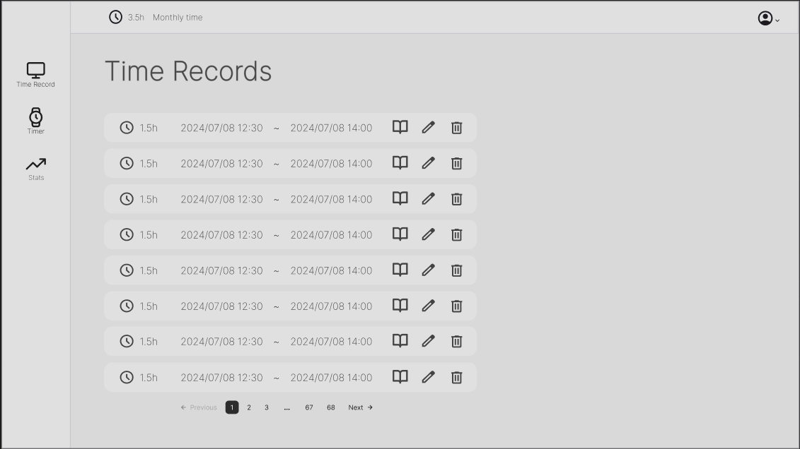
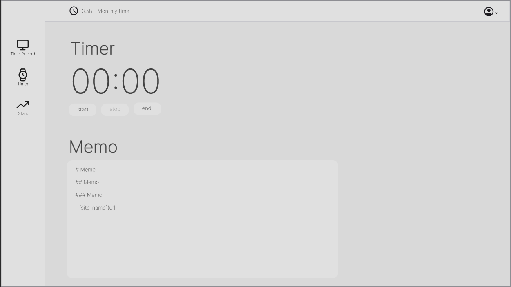
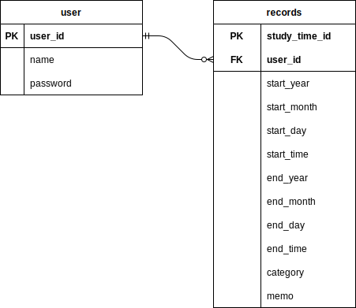

# 基本設計

## ソフトウェア構成

## 画面設計

### 画面一覧

| No. | 画面名             | 機能                                                                 | 遷移先画面       |
| --- | ------------------ | -------------------------------------------------------------------- | ---------------- |
| 1   | ログイン画面       | ユーザーのログインを行う。                                           | No.2             |
| 2   | メイン画面         | 学習記録の一覧を表示・削除・編集をする。                             | No.3, No.4, No.5 |
| 3   | 学習時間計測画面   | 学習時間の計測を行う。markdown方式で学習内容をメモすることが出来る。 | No.2             |
| 4   | 学習メモの閲覧画面 | 学習メモを表示・編集する。                                           | No.2             |
| 5   | スタッツ画面       | 学習時間の年・月・集単位で統計を表示する。                           | No.2             |

### 画面遷移図

### モックアップ

**1. メイン画面**

**2. 学習時間計測画面**

## 機能設計

### 機能一覧

| #   | 画面               | 機能                           | 実装方法など   | 必須 | 備考                                                                       |
| --- | ------------------ | ------------------------------ | -------------- | ---- | -------------------------------------------------------------------------- |
| 1   | ログイン画面       | ログインフォーム               | rails devise   | 〇   |                                                                            |
| 2   |                    | ユーザ登録機能                 | rails devise   |      |                                                                            |
| 3   | メイン画面         | 学習記録の一覧                 | CRUD           | 〇   | 学習記録には開始時間・終了時間・学習時間が表示される。                     |
| 4   |                    | 学習記録の編集ボタン           | CRUD           | 〇   | 各学習記録にある。開始時間・終了時間を編集できる。時間を増やす編集は不可。 |
| 5   |                    | 学習記録の削除ボタン           | CRUD           | 〇   | 各学習記録にある。                                                         |
| 6   |                    | 学習記録の一括削除ボタン       | CRUD           |      |                                                                            |
| 7   |                    | 学習記録のソート               | CRUD           |      | 年、月、勉強時間の多い順でソートが出来る。                                 |
| 8   |                    | 学習メモ閲覧ボタン             | CRUD           | 〇   | 各学習記録にある。クリックすると学習メモ閲覧画面へ遷移する。               |
| 9   |                    | 学習記録画面遷移ボタン         |                | 〇   | サイドバーにある。クリックすると学習記録計測画面へ遷移する。               |
| 10  |                    | スタッツの画面遷移ボタン       |                |      | サイドバーにある。クリックするとスタッツ画面へ遷移する。                   |
| 11  |                    | メイン画面遷移ボタン           |                | 〇   | サイドバーにある。クリックするとメイン画面へ遷移する。                     |
| 12  | 学習記録計測画面   | タイマーの開始                 | react-timer    | 〇   |                                                                            |
| 13  |                    | タイマーの一時停止             | react-timer    | 〇   |                                                                            |
| 14  |                    | タイマーの終了                 | react-timer    | 〇   | タイマーが終了すると記録が登録され、メイン画面に遷移する。                 |
| 15  |                    | 学習カテゴリの登録             | CRUD           | 〇   | 既存のカテゴリをドロップダウンで選択、または新規登録をする。               |
| 16  |                    | 学習メモの入力フォーム         | react-markdown | 〇   |                                                                            |
| 17  |                    | 参考にしたサイトの入力フォーム | CRUD           |      |                                                                            |
| 18  | 学習メモの閲覧画面 | 学習メモの表示                 | react-markdown | 〇   |                                                                            |
| 19  |                    | 学習記録の表示                 | CRUD           | 〇   |                                                                            |
| 20  |                    | 学習メモの編集ボタン           | CRUD           | 〇   | クリックすると学習メモの編集フォームと編集完了ボタンを表示する。           |
| 21  |                    | 学習メモの編集フォーム         | react-markdown | 〇   |                                                                            |
| 22  |                    | 学習メモの編集完了ボタン       | CRUD           | 〇   |                                                                            |
| 23  | スタッツ画面       | 表示スタッツの期間の選択ボタン | CRUD           |      | 年、月、週を選択できる。                                                   |
| 24  |                    | スタッツの表示                 | plotly         |      | 棒グラフで学習時間を表示する。                                             |

## データ設計

### テーブル一覧

1. users

| No. | カラム名 | データ型 | 制約                         | 説明               |
| --- | -------- | -------- | ---------------------------- | ------------------ |
| 1   | user_id  | integer  | PIRIMARY KEY, AUTO INCREMENT | ユーザーの一意のID |
| 2   | name     | varchar  | NOT NULL, UNIQUE             | ユーザー名         |
| 3   | password | varchar  | NOT NULL                     | パスワード         |

1. records

| No. | カラム名    | データ型 | 制約                        | 説明               |
| --- | ----------- | -------- | --------------------------- | ------------------ |
| 1   | record_id   | integer  | PRIMARY KEY, AUTO INCREMENT | 学習記録の一意のID |
| 2   | user_id     | integer  | FOREIGN KEY                 | ユーザーID         |
| 3   | start_year  | integer  | NOT NULL                    | 学習開始の年       |
| 4   | start_month | integer  | NOT NULL                    | 学習開始の月       |
| 5   | start_day   | integer  | NOT NULL                    | 学習開始の日       |
| 6   | start_time  | time     | NOT NULL                    | 学習開始の時間     |
| 7   | end_year    | integer  | NOT NULL                    | 学習終了の年       |
| 8   | end_month   | integer  | NOT NULL                    | 学習終了の月       |
| 9   | end_day     | integer  | NOT NULL                    | 学習終了の日       |
| 10  | end_time    | time     | NOT NULL                    | 学習終了の時間     |
| 11  | category    | varchar  |                             | 学習カテゴリ       |

### ER図

