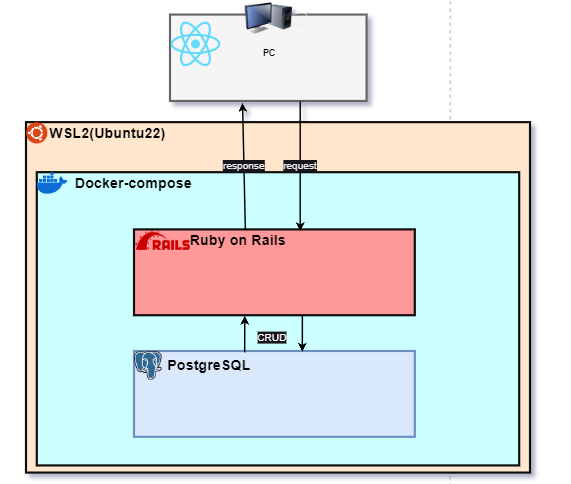

# 詳細設計

## ソフトウェア構成

## クラス設計

### model一覧

| No. | クラス名 | 概要         | 対応テーブル | 関連              |
| --- | -------- | ------------ | ------------ | ----------------- |
| 1   | User     | ユーザー情報 | users        | has_many :records |
| 2   | Record   | 学習記録     | records      | belongs_to :user  |
| 3   | Category | 学習カテゴリ | categories   |                   |

### controller一覧

| No. | クラス名                               | 概要                 | 対応モデル |
| --- | -------------------------------------- | -------------------- | ---------- |
| 1   | Api::V1::Auth::SessionsController      | ログイン・ログアウト | User       |
| 2   | Api::V1::Auth::RegistrationsController | ユーザー登録         | User       |
| 3   | Api::V1::RecordsController             | 学習記録のCRUD       | Record     |
| 4   | Api::V1::MonthlyTimeController         | 月間学習時間の取得   | Record     |
| 5   | Api::V1::WeeklyTimeController          | 週間学習時間の取得   | Record     |
| 6   | Api::V1::DailyTimeController           | 日間学習時間の取得   | Record     |
| 7   | Api::V1::CategoriesController          | カテゴリのCRUD       | Category   |

## API設計

### API一覧

| Prefix                          | Verb   | URI Pattern                           | Controller#Action                                  |
| ------------------------------- | ------ | ------------------------------------- | -------------------------------------------------- |
| new_api_v1_user_session         | GET    | /api/v1/auth/sign_in(.:format)        | devise_token_auth/sessions#new                     |
| api_v1_user_session             | POST   | /api/v1/auth/sign_in(.:format)        | devise_token_auth/sessions#create                  |
| destroy_api_v1_user_session     | DELETE | /api/v1/auth/sign_out(.:format)       | devise_token_auth/sessions#destroy                 |
| new_api_v1_user_password        | GET    | /api/v1/auth/password/new(.:format)   | devise_token_auth/passwords#new                    |
| edit_api_v1_user_password       | GET    | /api/v1/auth/password/edit(.:format)  | devise_token_auth/passwords#edit                   |
| api_v1_user_password            | PATCH  | /api/v1/auth/password(.:format)       | devise_token_auth/passwords#update                 |
|                                 | PUT    | /api/v1/auth/password(.:format)       | devise_token_auth/passwords#update                 |
|                                 | POST   | /api/v1/auth/password(.:format)       | devise_token_auth/passwords#create                 |
| cancel_api_v1_user_registration | GET    | /api/v1/auth/cancel(.:format)         | api/v1/auth/registrations#cancel                   |
| new_api_v1_user_registration    | GET    | /api/v1/auth/sign_up(.:format)        | api/v1/auth/registrations#new                      |
| edit_api_v1_user_registration   | GET    | /api/v1/auth/edit(.:format)           | api/v1/auth/registrations#edit                     |
| api_v1_user_registration        | PATCH  | /api/v1/auth(.:format)                | api/v1/auth/registrations#update                   |
|                                 | PUT    | /api/v1/auth(.:format)                | api/v1/auth/registrations#update                   |
|                                 | DELETE | /api/v1/auth(.:format)                | api/v1/auth/registrations#destroy                  |
|                                 | POST   | /api/v1/auth(.:format)                | api/v1/auth/registrations#create                   |
| api_v1_auth_validate_token      | GET    | /api/v1/auth/validate_token(.:format) | devise_token_auth/token_validations#validate_token |
| api_v1_auth_sessions            | GET    | /api/v1/auth/sessions(.:format)       | api/v1/auth/sessions#index                         |
| api_v1_records                  | GET    | /api/v1/records(.:format)             | api/v1/records#index                               |
|                                 | POST   | /api/v1/records(.:format)             | api/v1/records#create                              |
| api_v1_record                   | GET    | /api/v1/records/:id(.:format)         | api/v1/records#show                                |
|                                 | PATCH  | /api/v1/records/:id(.:format)         | api/v1/records#update                              |
|                                 | PUT    | /api/v1/records/:id(.:format)         | api/v1/records#update                              |
|                                 | DELETE | /api/v1/records/:id(.:format)         | api/v1/records#destroy                             |
| api_v1_monthly_time_index       | GET    | /api/v1/monthly_time(.:format)        | api/v1/monthly_time#index                          |

### ステータスコード

| ステータスコード | 意味                  |
| ---------------- | --------------------- |
| 200              | success               |
| 201              | created               |
| 204              | deleted               |
| 400              | bad request           |
| 401              | unauthorized          |
| 404              | not found             |
| 422              | unprocessable entity  |
| 500              | internal server error |